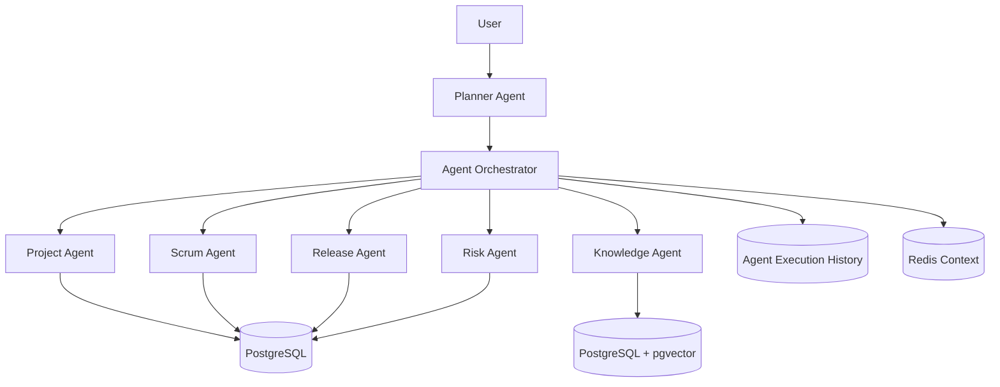

# NexusOps AI Project Manager

NexusOps is a local, Docker Compose based AI project management platform with a Java 21/Spring Boot backend, React 19 frontend, PostgreSQL with pgvector, Redis, and Ollama.

## Capabilities

- JWT authentication with role based access control.
- Modular multi-agent architecture: planner, project, scrum, release, knowledge, and risk agents.
- Agent orchestration with execution history, retries, Redis-backed context, and pluggable agent registry.
- RAG knowledge base with document ingestion, chunking, embeddings, semantic search, and question answering.
- Project, sprint, release, risk, document, prompt, model, analytics, and monitoring APIs.
- Enterprise SaaS frontend with dashboard, projects, scrum board, releases, risks, knowledge, AI assistant, analytics, agent monitor, and settings.
- Flyway migrations, OpenAPI, Actuator, request logging, Docker infrastructure, and test scaffolding.

## Quick Start

```bash
docker compose up --build
```

Open:

- Frontend: http://localhost:3000
- Backend API: http://localhost:8080/api
- Swagger UI: http://localhost:8080/swagger-ui.html
- Actuator health: http://localhost:8080/actuator/health

Default local user is seeded by Flyway:

- Email: `admin@nexusops.local`
- Password: `admin123`

Pull an Ollama model before using AI-heavy flows:

```bash
docker compose exec ollama ollama pull llama3
```

## Architecture



Agents implement a shared `Agent` interface and are registered through `AgentRegistry`. Agents never call each other directly; `AgentOrchestratorService` is the only coordination path. New agents can be added by implementing the interface and registering an `AgentType` without changing existing agent logic.

## Repository Layout

```text
backend/   Java 21, Spring Boot, Spring AI, JPA, Flyway, Security
frontend/  React 19, TypeScript, Vite, Material UI, React Query, Zustand
docs/      Architecture, database, setup, and agent design documentation
```

## Development

Backend:

```bash
cd backend
mvn test
mvn spring-boot:run
```

Frontend:

```bash
cd frontend
npm install
npm run dev
```

## Production Notes

- Replace `APP_JWT_SECRET` with a managed secret.
- Put Ollama behind private networking or replace `AiService` with a managed model provider adapter.
- Use managed PostgreSQL with pgvector and managed Redis for production.
- Add Kafka by replacing Spring event listeners with message publishers at the event boundary.
- Configure SSO/OIDC if enterprise identity is required.
